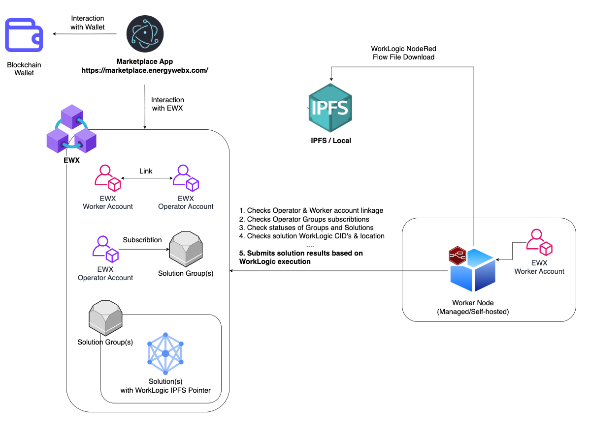

# EWX Worker Node

## Overview

### What is a Worker Node?

Worker Node is an lightweight offchain processing unit with an ability to execute business logic in a form of NodeRed flow file.

Worker Node executing logic can actively contribute in meaningful way to range of use cases.
Examples can be found here: [Worker Node Usage Use Cases](https://docs.energyweb.org/ewx-ecosystem/worker-nodes/sample-enterprise-use-cases).

Worker Nodes functionalities and **EWX** blockchain connection enables transparency and verification capabilities for your system.
Additionaly, thanks to its lightweight architecture, worker nodes are perfectly suitable and a good fit for applications that require decetralized execution components.

---

### How can it be used?

Worker Node, apart from its initial set-up, is entirely controlled by **Blockchain based actions**.
That means once your initial Worker set-up is completed no more changes would need to be applied afterwards.

Blockchain based action controlling Worker Node behaviour could be applied via Marketplace App -> which is EW built Blockchain Operator UI or directly interacting with blockchain.

For full documentation please visit [Worker Node Server Official Documnetation](https://docs.energyweb.org/ewx-ecosystem/worker-nodes/server-based-worker-nodes).

---

## High level architecture within EWX ecosystem

Below you can find a High Level Architecture to understand how worker node fit into larger EWX ecosystem. 

---

## Getting started

If you would like to run Worker Node in fully managed (SaaS) or in Bring your own cloud (BYOC) mode, please refer to our [Launchpad](https://launchpad.energyweb.org) Worker Node offering.
Worker Node Managed Offering Documentation can be found here: [Worker Node Managed Offer](https://docs.energyweb.org/launchpad/ewx-ecosystem-offerings/worker-node)

**If you would like to proceed with self-deployment option, use instructions described below.**

---

### 0. Prepare Worker & Operator Accounts

As blockchain-based operations and setting up Worker Node server are independent you can eaither proceed with blockchain-based preparation now, or after you are finished with Worker Node set-up.

If you would like to proceed with Blockchain-setup now go to [Blockchain Account Set Up Documentation](https://docs.energyweb.org/ewx-ecosystem/worker-nodes/server-based-worker-nodes/bootstrapping-server-based-worker-node-accounts) and follow the insturctions.

---

### 1. Prepare IPFS

Worker Node gets solutions Worklogic NodeRed flow files from [IPFS (Inter Planetary File System)](https://ipfs.tech).
Hence, if solutions you intend to run are stored in IPFS, you need to configure proper credentials.

By default it's configured to `ipfs.io` so there is no configuration required but if you experience any issues with that you can switch to different [IPFS Gateway](https://ipfs.github.io/public-gateway-checker/).

In order to make it work you need to modify `IPFS_URL` environment variable with one of the gateways.

#### 1.1 Infura IPFS

It's possible to use it with Infura IPFS, in order to do that provide `IPFS_API_KEY` and `IPFS_SECRET_KEY`. Change `IPFS_URL` to `https://ipfs.infura.io:5001` and set `IPFS_CONTEXT_PATH` to `/api/v0/cat?arg=`.

**If you intend to ONLY run Solutions that have their WorkLogic stored locally, you can configure any dummy values for IPFS**.

---

### 2. Download Docker Image

The Docker image is available at the following link: [ewx-worker-node-server](https://github.com/energywebfoundation/ewx-worker-node-server/pkgs/container/ewx-worker-node-server%2Fewx-worker-node-server).

Run the following command to pull the image:

```bash
docker pull ghcr.io/energywebfoundation/ewx-worker-node-server/ewx-worker-node-server:latest
```

---

### 3. Set Up Environment Variables

You can read more about the environment variables [here](docs/env-vars.md).

1. Run the following command to copy the default environment file:

   ```bash
   cp .env.default .env
   ```

2. Replace `<SEED>` under the `VOTING_WORKER_SEED` key with your Worker Account Seed. Keep in mind that your Worker Account have to be different thatn Operator Account. If you havent done it already, to generate Worker Node account you can use any of the wallets mentioned in official [Polkadot Docs](https://wiki.polkadot.network/docs/wallets-and-extensions)
3. Replace `<infura_ipfs_APIKEY>` & `<infura_ipfs_APISECRET>` with your infura API key and secret
4. Optionally, you can change `PRETTY_PRINT` to `true` or `false` depending on your use case.

---

### 4. Run Docker Image

You can run the worker node with Kubernetes, Docker Compose, or natively.

#### **Using Docker:**

```bash
docker run --env-file .env --rm ghcr.io/energywebfoundation/ewx-worker-node-server/ewx-worker-node-server:latest
```

#### **Using Docker Compose:**

```bash
docker compose up
```

#### **Using Helm + Kubernetes:**

`> Make sure SEED, ipfs_APIKEY & ipfs_APISECRET are also replaced in ./helm-chart/values.yaml`

```bash
helm install ewx-workers-node-service -f helm-chart/values.yaml oci://ghcr.io/energywebfoundation/generic-microservice-helm  -n ewx
```

---

### 5. Verify your Worker Node status

Call `GET http://localhost:3002/status`

| Status                     | Description                                |
| -------------------------- | ------------------------------------------ |
| STARTED                    | The application has started bootstrapping. |
| EXPOSED_HTTP               | The HTTP server has been exposed.          |
| INITIALIZED_WORKER_ACCOUNT | The worker account has been initialized.   |
| PERFORMED_CHECKS           | Required checks have been performed.       |
| STARTED_RED_SERVER         | The NodeRed server has started.            |
| READY                      | The application is fully ready.            |

---

### 6. Prepare Worker & Operator Accounts

Your Worker Set-up is Completed! From that moment most of the following, neccesary operations will need to be conducted with usage of your Operator Account against EWX.
If you havent went through Blockchain set-up earlier (as a part of step 0), you can proceed to prepare Blockchain-based set-up now in order for your Worker to start running desired logic.

Please proceed to [Operator Account Set Up Documentation](https://docs.energyweb.org/ewx-ecosystem/worker-nodes/server-based-worker-nodes/bootstrapping-server-based-worker-node-accounts) and go through set-up instructions.

---

### 7. Verify whether your worker is properly running

1. When you subscribe to any **Solution Group** using your **Operator Account** linked to **Worker Account** configured for your Worker, there is a max-24-hours period before any votes from your Worker will be accepted by EWX.
2. After that time, your worker will start executing **Solutions WorkLogic** from **Solutions** that are in **Active state** in **non-expired Solution Groups** that your **Operator Account** is subscribed to.
3. You should be able to view votes being submitted from your Worker
   - In Worker Node logs
   - In [Marketplace App UI](https://marketplace.energywebx.com/) after checking details of Solution Groups you subscribed to
   - By querring [EWX chainstate](https://polkadot.js.org/apps/?rpc=wss%3A%2F%2Fpublic-rpc.mainnet.energywebx.com%2Fws#/chainstate) as shown in [Picture](images/chainstate-query.png) (Use Operator Address here)
   - By Querring [EWX indexer](https://ewx-indexer.mainnet.energywebx.com/graphql) as shown in [Screenshot](images/indexer-query.png) (Use Worker Address here)

Keep in mind, that depending on solution WorkLogic that yor Worker is running - frequency, quantity of votes and way of interaction with EWX might significantly vary.

The best way to check whether your Worker is failing, is to monitor logs for errors & Worker Node status

---

## Build Docker Image

To build the Docker image locally, run the following command:

```bash
docker build --tag ewx-worker-node-server:latest .
```

---

## Build and Run Locally

1. Run the following command to build the project:

   ```bash
   npm run build
   ```

2. Run the project using Node.js:

   ```bash
   node dist/main.js
   ```

---

## Security and scalability considerations

1. While nothing prevents assignment of public endpoint to the Worker Node, recommended and advised use always assumes that it is securely placed in private network and use NodeRed flows with either scheduled or pull based triggers.

2. Each worker node should have an unique Worker Account seed and always run in single replica mode. Multiple replica set-up could cause problems if used with certain applications. To ensure reliability by scallability, always configure unique Worker Account seeds for each Worker Node instance.

3. Always treat worker seed as a secret value.

---

## FAQ

### **Q: Is there an alternative way to create an operator account?**

A: Yes, follow these steps to manually create an operator account:

1. Visit [PolkadotJS](https://polkadot.js.org/apps/).
2. Select **MAINNET EWX**, depending on your use case.
3. Go to [PolkadotJS Extrinsics](https://polkadot.js.org/apps/#/extrinsics).
4. As the operator, call the extrinsic `workerNodePallet.signupWorkerNodeOperator`.
5. As the operator, call the extrinsic `workerNodePallet.registerWorker`, passing the address of your worker.
6. Finally, as the operator, call the extrinsic `workerNodePallet.subscribeOperatorToSolutionGroup`. To obtain the group, go to `Developer` -> `Chain state` -> `workerNodePallet` -> `solutionsGroups`.

### **Q: How many Worker Accounts can be assigned to single Operator Account ?**

A: For now, single Operator to Worker account assignment is supported. You can always disconnect previourly connected Worker Account and replace it with different one.

### **Q: Can I switch between Managed/Self-hosted verions of Worker Node ?**

A: Yes, you can switch and move to new Worker any moment. If you dont want to tamper with blockchain-setup you just need to use the same Worker Account Seed in your new Worker. Keep in mind that old Worker Node instance should be stopped right after new one is set up.

## **For Full version of FAQ, please check our [Official Docs](https://docs.energyweb.org/ewx-ecosystem/worker-nodes/server-based-worker-nodes/faq-server-based-worker-nodes)**

<p align="right">(<a href="#readme-top">back to top</a>)</p>

---

## Security Audits

- [01.12.2023 Audit Report - cure53](https://github.com/energywebfoundation/ew-marketplace/) _(Not Available Yet)_

<p align="right">(<a href="#readme-top">back to top</a>)</p>

---

## Maintainers

- [Christopher Szostak](https://github.com/hejkerooo)
- [Vicken Liu](https://github.com/vickenliu)
- [Kamil Witkowski](https://github.com/KaamilW)

---

## Contributing

Contributions are what make the open-source community such an amazing place to learn, inspire, and create. Any contributions you make are **greatly appreciated**.

If you have a suggestion that would make this project better, please fork the repo and create a pull request. You can also simply open an issue with the tag "enhancement".

Here’s how you can contribute:

1. Fork the Project
2. Create your Feature Branch (`git checkout -b feature/AmazingFeature`)
3. Commit your Changes (`git commit -m 'feat: Add some AmazingFeature'`) following [Conventional Commits](https://www.conventionalcommits.org/en/v1.0.0/)
4. Push to the Branch (`git push origin feature/AmazingFeature`)
5. Open a Pull Request

<p align="right">(<a href="#readme-top">back to top</a>)</p>

---

## License

This project is licensed under the GNU General Public License v3.0 or later. See the [LICENSE](/LICENSE) file for details.

<p align="right">(<a href="#readme-top">back to top</a>)</p>

---

## Contact

- [X](https://x.com/xenergyweb)

- [Discord](https://discord.gg/psraNwqGqp)
- [Telegram](https://t.me/energyweb)

Project Link: [ewx-worker-node-server](https://github.com/energywebfoundation/ewx-worker-node-server)

<p align="right">(<a href="#readme-top">back to top</a>)</p>
